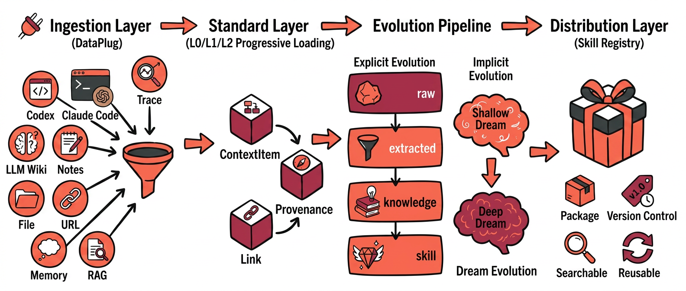

# ContextSeek
[](https://pypi.org/project/contextseek/)
[](https://img.shields.io/pypi/dm/contextseek)
[](https://pypi.org/project/contextseek/)
[](LICENSE)
[](https://discord.com/invite/74cF8vbNEs)

Semantic context infrastructure for AI agents — a unified, retrievable, traceable, self-evolving context layer between your LLM and your agent runtime. [中文文档](README_CN.md)

## System Design



## Why ContextSeek

Agent self-evolution is taking shape along two technical paths. One extracts and solidifies experience from runtime behavior (e.g. [Hermes](https://github.com/NousResearch/hermes-agent), [OpenHuman](https://github.com/tinyhumansai/openhuman)). The other evolves the **context infrastructure** beneath the agent — organizing, updating, and linking context automatically — without touching agent execution logic. ContextSeek focuses on the latter, turning one-off task-level gains into compounding value across the context lifecycle.

Three constraints stand in the way today:

- **Heterogeneous integration** — Memory, Trace, RAG, and skill stores expose incompatible APIs and semantic conventions.
- **Insufficient retention** — runtime experience is consumed in the prompt window and rarely becomes reusable capability.
- **Missing provenance** — outputs lack a traceable evidence chain.

ContextSeek converges these into a **single object model**: everything is a `ContextItem` — retrievable and traceable — that progresses automatically through `raw → extracted → knowledge → skill`.

## Capabilities at a glance

| Area | What it does | Key API |
|---|---|---|
| **Unified ingest** | Pull from RAG pipelines, memory stores, execution traces, skill/tool registries through one `DataPlug` interface | `plug()`, `add()` |
| **Hybrid retrieval** | Keyword + vector recall, optional LLM rerank, scope routing, tiered L0/L1/L2 surfaces | `retrieve()`, `expand()` |
| **Geo-aware search** | First-class spatial recall with distance decay, fused with semantic ranking | `retrieve(geo_query=…)` |
| **Self-evolution** | Merge duplicates, resolve conflicts, advance stages, distill skills — incrementally or on demand | `compact()`, `dream()` |
| **Learning loop** | Runtime automatically attributes retrieval signals so useful context is reinforced and dead context decays | `feedback()` |
| **Skills as tools** | Distilled skills export directly as LLM tool defs or a Hermes-style system prompt | `skill_tools()`, `skill_context()` |
| **Provenance** | Every item carries mandatory `Provenance` + typed `Link` edges → full evidence-chain DAG | `evidence_chain()`, `upstream()`, `chain_confidence()` |

## Quick Start

```bash
pip install contextseek
```

```python
from contextseek import ContextSeek

ctx = ContextSeek.from_settings()  # reads .env or environment variables

# Write
ctx.add(
    "OceanBase is a financial-grade distributed database supporting HTAP workloads",
    scope="acme/db/engineer",
    source="wiki",
)

# Retrieve (ranked SearchHits; L1 summaries by default)
for hit in ctx.retrieve("distributed database", scope="acme/db/engineer", k=10):
    text = hit.item.summary or hit.item.content
    print(f"[{hit.item.stage.value}] score={hit.score:.2f} | {text[:100]}")
```

Configure via `.env` (see [.env.example](.env.example)) or `ContextSeekSettings` in code. A storage backend, an embedding provider, and an LLM are the three required pieces.

Prefer the command line? The `contextseek` CLI runs a self-contained personal knowledge base with the embedded `seekdb` backend — no external service required:

```bash
pip install "contextseek[seekdb]"
contextseek init                                   # set up ~/.contextseek/ + background daemon
contextseek sync ~/notes --scope me/work           # import notes/docs (format auto-detected)
contextseek retrieve --scope me/work --query "..." # retrieve from the CLI or expose it over MCP
```

See the [CLI guide](docs/en/guides/cli.md) for the full command reference.

## Configuration management

ContextSeek ships a versioned, traceable, rollback-able configuration store:

```bash
contextseek config import --apply          # first-time: ingest existing .env/config.json as v1
contextseek config set llm.model gpt-4o --reason "init llm"
contextseek config history
contextseek config rollback v000001
contextseek config ingest agentseek --path agentseek.env --apply
contextseek config verify
```

Every change is an append-only version with provenance (author, reason, origin). Rollback creates a new version — history is never deleted. agentseek config can be ingested and projected into the `projected` layer without reverse-writing agentseek.

## Core concepts in 60 seconds

- **`ContextItem`** — the single object for memory, knowledge, traces, and skills. It carries content, a `stage`, mandatory `Provenance`, and typed `Link` edges.
- **Stages** — items advance `raw → extracted → knowledge → skill` as the evolution engine processes them. You retrieve across stages or filter to one.
- **Content tiers** — L0 (full body, via `expand()`), L1 (~2 k-token summary, the default `retrieve()` surface), L2 (~100 tokens, drives embedding recall).
- **Scopes** — hierarchical namespaces like `acme/bot/user_123` for routing, isolation, and rollups (`scope_tree()`, `scope_stats()`).
- **Provenance & Links** — `supports / refutes / derives / supersedes` edges make every conclusion traceable to its evidence.

## What you can build

### Self-evolving memory (the learning loop)

The minimal loop has three steps: **retrieve → (runtime auto-attribution) → optional explicit feedback + evolution**.

```python
# 1) Retrieve candidate context (runtime records retrieval attribution signals)
resp = ctx.retrieve("deployment runbook", scope="acme/ops", k=10)

# 2) Optional: attach explicit feedback to key items (positive or negative)
ctx.feedback(resp[0].item.id, scope="acme/ops", score=1.0, reason="resolved the incident")

# 3) Trigger evolution: compact for convergence, dream for idle-time consolidation
ctx.compact(scope="acme/ops")  # merge, resolve conflicts, advance stages
ctx.dream(scope="acme/ops")    # idle-time consolidation + cross-cluster hypotheses
```

### Skills as first-class tools

Distilled `skill`-stage items export directly into your agent — no glue code.

```python
# Skills the evolution engine distilled from accumulated experience
skills = ctx.skills("acme/coding", skill_type="tool", k=20)

# Hand them to an OpenAI / Anthropic agent as tool definitions...
tool_defs = ctx.skill_tools("acme/coding", fmt="openai")

# ...or inject them as a Hermes-style system-prompt block
system_block = ctx.skill_context("acme/coding", query="refactor a Django view")
```

### Traceable RAG with an evidence chain

Every answer can be walked back to its supporting sources, with confidence propagated through the DAG.

```python
hit = ctx.retrieve("why did we migrate off Redis?", scope="acme/eng", k=1)[0]

chain = ctx.evidence_chain(hit.item.id, scope="acme/eng")   # full provenance DAG
sources = ctx.upstream(hit.item.id, scope="acme/eng")        # direct upstream items
confidence = ctx.chain_confidence(hit.item.id, scope="acme/eng")  # propagated confidence
```

### Geo-aware retrieval

Fuse spatial proximity with semantic ranking — POI search, dispatch, HD-map context, and more.

```python
from contextseek import GeoPoint, GeoQuery

geo = GeoQuery(center=GeoPoint(lat=39.9110, lon=116.3720), radius_km=5.0,
               geo_type_filter=["poi"])
hits = ctx.retrieve("good restaurants nearby", scope="maps/poi", k=10, geo_query=geo)
```

Backed by `OceanBaseGeoBackend` (OceanBase ≥ 4.2.2 or `seekdb`); enable with `GEO_ENABLED=true`. See the [GIS examples](examples/gis/).

## Integrations

### LangChain middleware (drop-in)

Wire retrieval, storage, compaction, and dreaming into a `create_agent()` agent with one middleware:

```python
from langchain.agents import create_agent
from contextseek.bridges.langchain.middleware import ContextSeekMiddleware

agent = create_agent(
    model="openai:gpt-4o",
    middleware=[
        ContextSeekMiddleware(
            scope="my_project",
            retrieval_k=10,     # inject top-k context before each model call
            auto_store=True,    # persist assistant turns back into ContextSeek
            auto_compact=True,  # evolve the scope every N turns
            auto_dream=True,    # idle-time consolidation
        )
    ],
)
```

A [DeepAgents](https://github.com/langchain-ai/deepagents) bridge is available too — see [examples/basic/langchain_deepagents_example.py](examples/basic/langchain_deepagents_example.py).

### DataPlugs — ingest from anywhere

| Plug | Source | Class |
|---|---|---|
| RAG | document/chunk pipelines | `RAGPlug` |
| Memory | conversational memory stores (PowerMem) | `PowerMemPlug` |
| Trace | agent execution traces | `TracePlug` |
| Skills | Hermes skills, MCP tools, OpenAI functions | `HermesSkillImporter`, `MCPToolImporter`, `OpenAIFunctionImporter` |

```python
from contextseek.plugs.rag import RAGPlug

ctx.plug(RAGPlug(...), scope="acme/docs")  # one interface for every source
```

See the [DataPlugs guide](docs/en/guides/integrations/dataplugs.md).

### Serving surfaces

- **Python SDK** — `from contextseek import ContextSeek`
- **CLI** — `contextseek` with embedded `seekdb` + background `daemon` for file watching/sync
- **HTTP** — FastAPI server: `uvicorn contextseek.http.server:app` (`pip install "contextseek[http]"`)
- **MCP** — stdio and SSE servers (`contextseek-mcp-stdio` / `contextseek-mcp-sse`) for remote agent integration
- **Tool specs** — `ctx.tools()` returns OpenAI/Anthropic tool definitions for direct agent wiring

## How it works

- **Unified object model** — all context is a `ContextItem` with mandatory `Provenance` (source type, source id, confidence) and typed `Link` edges (supports, refutes, derives, supersedes), enabling a full `EvidenceChain` DAG with confidence propagation.
- **Retrieval orchestrator** — keyword + vector hybrid recall, optional LLM reranking, scope-based routing, and optional geo fusion. Returns ranked `SearchHit` rows.
- **EvolutionEngine** — watches for items that can be merged, conflict-resolved, advanced in stage, or distilled into skills. Runs incrementally after writes or on an explicit `compact()`.
- **DreamEngine** — idle-time pattern consolidation and cross-cluster hypothesis generation, triggered via `dream()`.
- **Governance** — `tag()` attaches audit metadata to every operation in a `with` block; `pin()` labels a policy version; the observability layer emits audit logs and metrics.

## Documentation

- [Getting started (EN)](docs/en/getting-started/quickstart.md) / [快速上手 (ZH)](docs/zh/getting-started/quickstart.md): installation, `.env` setup, and a walkthrough of the core operations.
- [Client API reference](docs/en/reference/api.md): full signatures for `add`, `retrieve`, `expand`, `compact`, `dream`, `evidence_chain`, `skills`, and more.
- [Configuration reference](docs/en/getting-started/configuration.md): all environment variables and `ContextSeekSettings` fields.
- [CLI (client-side)](docs/en/guides/cli.md) / [中文](docs/zh/guides/cli.md): personal mode with embedded `seekdb` — `init`, the background `daemon`, `sync`, and the full command reference.
- [DataPlugs](docs/en/guides/integrations/dataplugs.md): ingest from RAG pipelines, memory stores, execution traces, and skill / tool registries.
- [LangChain middleware](docs/en/guides/integrations/langchain-middleware.md) / [中文](docs/zh/guides/integrations/langchain-middleware.md): drop-in `AgentMiddleware` that wires ContextSeek into a `create_agent()` agent.
- [Examples](examples/README.md): annotated scripts for common workflows.
- [AppWorld eval](eval/appworld/README.md) / [τ-bench eval](eval/taubench/README.md): optional evaluation harnesses with their own setup requirements.

## License

[Apache License 2.0](LICENSE)
