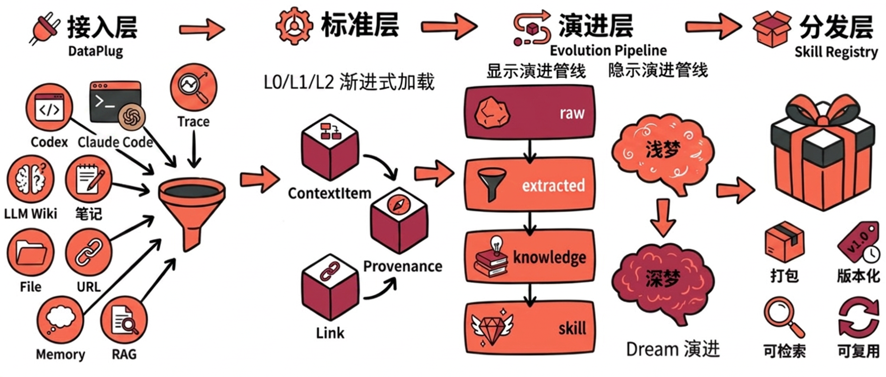

# ContextSeek

[](https://pypi.org/project/contextseek/)
[]((https://img.shields.io/pypi/dm/contextseek))
[](https://pypi.org/project/contextseek/)
[](LICENSE)
[](https://discord.com/invite/74cF8vbNEs)

面向 AI Agent 的语义上下文基础设施 —— 位于 LLM 与 Agent 运行时之间，统一、可检索、可溯源、可自进化的上下文层。[English](README.md)

## 系统设计



## 为什么需要 ContextSeek

Agent 的自进化沿两条技术路线展开：其一，从运行行为中抽取并固化经验（如 [Hermes](https://github.com/NousResearch/hermes-agent)、[OpenHuman](https://github.com/tinyhumansai/openhuman)）；其二，不改造 Agent 执行逻辑，而演进其依赖的**上下文基础设施**——自动组织、持续更新与关联发现。ContextSeek 聚焦后一路径，将能力增益从任务级一次性收益，转化为上下文层的跨周期复合累积。

要释放这一路径的价值，当前架构仍面临三类约束：

- **接入异构** —— Memory、Trace、RAG、Skill 等组件接口与语义约定不统一；
- **沉淀不足** —— 运行经验随 Prompt 窗口消耗，难以转化为可复用能力；
- **溯源缺失** —— 输出结论缺乏可追溯的证据链。

ContextSeek 将上述能力收敛于**单一对象模型**——一切表示为 `ContextItem`，可检索、可溯源，并沿 `raw → extracted → knowledge → skill` 生命周期自动演进。

## 能力总览

| 能力 | 说明 | 核心 API |
|---|---|---|
| **统一接入** | 通过单一 `DataPlug` 接口从 RAG 流水线、记忆库、执行轨迹、技能/工具注册表导入 | `plug()`、`add()` |
| **混合检索** | 关键词 + 向量召回、可选 LLM 重排、scope 路由、L0/L1/L2 分层 | `retrieve()`、`expand()` |
| **地理感知检索** | 一级的空间召回，带距离衰减，与语义排序融合 | `retrieve(geo_query=…)` |
| **自进化** | 合并去重、消解冲突、推进阶段、提炼技能——增量或按需触发 | `compact()`、`dream()` |
| **学习闭环** | 运行时自动归因检索信号，强化有用上下文、衰减无用上下文 | `feedback()` |
| **技能即工具** | 蒸馏出的技能直接导出为 LLM 工具定义或 Hermes 风格 system prompt | `skill_tools()`、`skill_context()` |
| **溯源** | 每条目携带强制 `Provenance` + 有类型 `Link` 边 → 完整证据链 DAG | `evidence_chain()`、`upstream()`、`chain_confidence()` |

## 快速开始

```bash
pip install contextseek
```

```python
from contextseek import ContextSeek

ctx = ContextSeek.from_settings()  # 自动读取 .env 或环境变量

# 写入
ctx.add(
    "OceanBase 是一款金融级分布式数据库，支持 HTAP 混合负载",
    scope="acme/db/engineer",
    source="wiki",
)

# 检索（排名 SearchHit；默认返回 L1 摘要）
for hit in ctx.retrieve("分布式数据库", scope="acme/db/engineer", k=10):
    text = hit.item.summary or hit.item.content
    print(f"[{hit.item.stage.value}] score={hit.score:.2f} | {text[:100]}")
```

通过 `.env` 配置（参见 [.env.example](.env.example)）或在代码中构造 `ContextSeekSettings`。存储后端、Embedding 提供方和 LLM 是三个必要配置项。

更习惯命令行？`contextseek` CLI 用内置 `seekdb` 跑一个自包含的个人知识库，无需任何外部服务：

```bash
pip install "contextseek[seekdb]"
contextseek init                                   # 初始化 ~/.contextseek/ 及后台 daemon
contextseek sync ~/notes --scope me/work           # 导入笔记/文档（自动识别格式）
contextseek retrieve --scope me/work --query "..." # 在 CLI 检索，或通过 MCP 暴露
```

完整命令见 [CLI 指南](docs/zh/guides/cli.md)。

## 60 秒理解核心概念

- **`ContextItem`** —— 记忆、知识、轨迹、技能的统一对象，携带内容、`stage`、强制 `Provenance` 与有类型 `Link` 边。
- **阶段(Stage)** —— 随演进引擎处理，条目沿 `raw → extracted → knowledge → skill` 推进。可跨阶段检索，也可过滤到单一阶段。
- **内容分层** —— L0（完整正文，经 `expand()` 获取）、L1（约 2k token 摘要，`retrieve()` 默认返回面）、L2（约 100 token，驱动 Embedding 召回）。
- **Scope** —— 形如 `acme/bot/user_123` 的层级命名空间，用于路由、隔离与汇总（`scope_tree()`、`scope_stats()`）。
- **Provenance & Link** —— `supports / refutes / derives / supersedes` 边让每个结论都可回溯到其证据。

## 能用来做什么

### 自进化记忆（学习闭环）

最小闭环是 3 步：**先检索 →（系统自动归因）→ 可选补充显式反馈并触发演进整理**。

```python
# 1) 先检索出候选上下文（运行时会自动记录检索归因信号）
resp = ctx.retrieve("部署手册", scope="acme/ops", k=10)

# 2) 可选：对关键条目追加人工/程序反馈（正向或负向）
ctx.feedback(resp[0].item.id, scope="acme/ops", score=1.0, reason="解决了故障")

# 3) 触发演进：compact 做“收敛整理”，dream 做“闲时整合”
ctx.compact(scope="acme/ops")  # 合并、去重、冲突消解、阶段推进
ctx.dream(scope="acme/ops")    # 跨簇模式整合与假设生成
```

### skill 为一等公民

蒸馏出的 `skill` 阶段条目可直接注入 Agent，无需胶水代码。

```python
# 演进引擎从累积经验中蒸馏出的技能
skills = ctx.skills("acme/coding", skill_type="tool", k=20)

# 作为工具定义交给 OpenAI / Anthropic Agent……
tool_defs = ctx.skill_tools("acme/coding", fmt="openai")

# ……或作为 Hermes 风格 system prompt 块注入
system_block = ctx.skill_context("acme/coding", query="重构一个 Django 视图")
```

### 带证据链的可溯源上下文

每个答案都能回溯到支撑来源，置信度沿 DAG 传播。

```python
hit = ctx.retrieve("我们为什么从 Redis 迁走？", scope="acme/eng", k=1)[0]

chain = ctx.evidence_chain(hit.item.id, scope="acme/eng")        # 完整溯源 DAG
sources = ctx.upstream(hit.item.id, scope="acme/eng")            # 直接上游条目
confidence = ctx.chain_confidence(hit.item.id, scope="acme/eng") # 传播后的置信度
```

### 地理感知检索

将空间邻近与语义排序融合——POI 搜索、调度派单、高精地图上下文等。

```python
from contextseek import GeoPoint, GeoQuery

geo = GeoQuery(center=GeoPoint(lat=39.9110, lon=116.3720), radius_km=5.0,
               geo_type_filter=["poi"])
hits = ctx.retrieve("附近好吃的餐厅", scope="maps/poi", k=10, geo_query=geo)
```

由 `OceanBaseGeoBackend` 支撑（OceanBase ≥ 4.2.2 或 `seekdb`）；以 `GEO_ENABLED=true` 启用。参见 [GIS 示例](examples/gis/)。

## 集成

### LangChain Middleware（开箱即用）

一个 middleware 即把检索、存储、compact、dream 接入 `create_agent()` 构建的 Agent：

```python
from langchain.agents import create_agent
from contextseek.bridges.langchain.middleware import ContextSeekMiddleware

agent = create_agent(
    model="openai:gpt-4o",
    middleware=[
        ContextSeekMiddleware(
            scope="my_project",
            retrieval_k=10,     # 每次模型调用前注入 top-k 上下文
            auto_store=True,    # 将助手回合写回 ContextSeek
            auto_compact=True,  # 每 N 个回合演进该 scope
            auto_dream=True,    # 闲时整合
        )
    ],
)
```

同时提供 [DeepAgents](https://github.com/langchain-ai/deepagents) 桥接 —— 参见 [examples/basic/langchain_deepagents_example.py](examples/basic/langchain_deepagents_example.py)。

### DataPlug —— 从任意来源接入

| Plug | 来源 | 类 |
|---|---|---|
| RAG | 文档/分块流水线 | `RAGPlug` |
| Memory | 对话记忆库（PowerMem） | `PowerMemPlug` |
| Trace | Agent 执行轨迹 | `TracePlug` |
| Skills | Hermes 技能、MCP 工具、OpenAI Function | `HermesSkillImporter`、`MCPToolImporter`、`OpenAIFunctionImporter` |

```python
from contextseek.plugs.rag import RAGPlug

ctx.plug(RAGPlug(...), scope="acme/docs")  # 一套接口对接所有来源
```

参见 [DataPlug 指南](docs/zh/guides/integrations/dataplugs.md)。

### 服务化形态

- **Python SDK** —— `from contextseek import ContextSeek`
- **CLI** —— `contextseek`，内置 `seekdb` + 后台 `daemon` 实现文件监听/同步
- **HTTP** —— FastAPI 服务：`uvicorn contextseek.http.server:app`（`pip install "contextseek[http]"`）
- **MCP** —— stdio 与 SSE 服务（`contextseek-mcp-stdio` / `contextseek-mcp-sse`），用于远程 Agent 集成
- **工具描述** —— `ctx.tools()` 返回 OpenAI/Anthropic 工具定义，可直接挂到 Agent

## 工作原理

- **统一对象模型** —— 一切都是 `ContextItem`，携带强制 `Provenance`（来源类型、来源 id、置信度）和有类型 `Link` 边（支持、反驳、衍生、替代），支持构建完整 `EvidenceChain` DAG 及置信度传播。
- **检索编排器** —— 关键词 + 向量混合召回、可选 LLM 重排、基于 scope 路由、可选地理融合，返回排名 `SearchHit` 行。
- **EvolutionEngine** —— 监测可合并、可消解冲突、可推进阶段或可提炼为技能的条目，在写入后增量运行，也可通过 `compact()` 显式触发。
- **DreamEngine** —— 闲时进行模式整合与跨簇假设生成，通过 `dream()` 触发。
- **统制治理** —— `tag()` 为 `with` 块内每个操作附加审计元数据；`pin()` 标记策略版本；可观测层输出审计日志与指标。

## 文档

- [快速上手 (ZH)](docs/zh/getting-started/quickstart.md) / [Getting started (EN)](docs/en/getting-started/quickstart.md)：安装、`.env` 配置，以及核心操作的完整演示。
- [客户端 API 参考](docs/zh/reference/api.md)：`add`、`retrieve`、`expand`、`compact`、`dream`、`evidence_chain`、`skills` 等方法的完整签名。
- [配置参考](docs/zh/getting-started/configuration.md)：所有环境变量与 `ContextSeekSettings` 字段。
- [CLI 命令行（端侧）](docs/zh/guides/cli.md) / [English](docs/en/guides/cli.md)：内置 `seekdb` 的个人模式 —— `init`、后台 `daemon`、`sync` 与命令全表。
- [DataPlug 指南](docs/zh/guides/integrations/dataplugs.md)：如何从 RAG 流水线、记忆库、执行轨迹及工具注册表导入数据。
- [LangChain Middleware](docs/zh/guides/integrations/langchain-middleware.md) / [English](docs/en/guides/integrations/langchain-middleware.md)：开箱即用的 `AgentMiddleware`，把 ContextSeek 接入 `create_agent()` 构建的 Agent。
- [示例](examples/README.md)：常见工作流的完整示例脚本。
- [AppWorld 评测](eval/appworld/README.md) / [τ-bench 评测](eval/taubench/README.md)：可选评测脚手架，有独立的依赖与配置要求。

## License

[Apache License 2.0](LICENSE)
